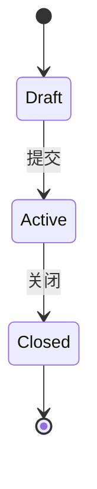

<!--
  这是 flows 模块文档的模板。新建模块时复制本文件为 flows/<模块>.md(小写英文,如 orders.md)。
  复制后:① 删掉所有 <!-- --> 注释 ② 把标题/前言换成本模块 ③ 在 flows/README.md 追加一行。

  五个固定章节,顺序不变。空的章节保留标题写「_(暂无)_」,不要删——AI 靠固定结构定位。
  顺序刻意把**最值钱的后台/跨模块**提到最前,状态机/主流程作参考材料沉到后面:
    前言(模块事实总结) → §1 后台处理与跨模块业务规则(重点) → §2 业务规则(本模块自身/界面骨架)
    → §3 状态机 → §4 主流程 → §5 开放问题登记

  —— ID 规则 ——
  • 模块前缀:取模块英文缩写,如 ORD=Orders、DEV=Devices、APP=Apps、CUS=Customers。
  • 规则     RULE-<前缀>-NN     业务规则,一条一个完整业务块。**§1 与 §2 共用同一条 RULE 序列**,
                              编号只看登记先后、不按章节;一条规则放 §1 还是 §2 由「重心」决定(见下)。
  • 流程     FLOW-<前缀>-NN     一张图对应一条流程
  • 开放问题 Q-<前缀>-NN        缺口/待确认
  • NN 单调递增,永不复用;删条目时其 ID 作废、不补号。这样引用("按 RULE-ORD-03 实现")永远稳定。
    条目在 §1/§2 间挪动时 **ID 不变**(编号与章节解耦)。

  —— 确认状态标签 ——(每条规则/流程都要带一个)
  • 〔确认〕    有明确来源(模型文档 / 用户拍板),可直接拿去开发
  • 〔确认·推论〕 某条〔确认〕的逻辑必然结果(A 已确认 → B 是 A 直接推出、别无可能),
                继承上游确认、定稿前无需再单独发问;条目里点名依据哪条(如「依 RULE-ORD-01」)。
                只用于"逻辑上跑不掉"的推论;凡还有别的可能,就仍是〔推断〕,老老实实去问。
  • 〔推断〕    从原型反推、合理但未验证;定稿前须逐条向用户确认,不能因"合理"就跳过
  • 〔待确认〕  明确的空白,当前是猜的;通常同时在第 5 节登记一个 Q-

  —— 重心归位(§1 还是 §2)——
  • 一条规则**整条**进一个章节,**绝不为了切章节把一个业务块拆两半**(铁律:一条规则=一个完整块)。
  • 看**重心**:重心在后台/跨模块(界面看不到的关联) → 整条进 §1;重心在本实体/界面可见 → 整条进 §2。
  • §1/§2 是**视角与侧重**之分,不是逐句硬分。只有当某条的后台尾巴本身**够大、自成一条**时,
    才在 §2 那条留一句「后台关联见 RULE-xx」,把尾巴独立成 §1 的一条。

  —— 维护原则 ——
  • append 优先:新认知就地加条目;改认知就地改那一条,不追加历史。
  • **不写源码文件名/模型文件名/字段名**:下一道开发工序会同时拿到模型、原型与本文件,只用业务语言描述行为;需指位置时只点名「哪个页面/哪个按钮」。
  • 图统一用 Mermaid(纯文本,人可看图、AI 可改写)。
-->

# <模块名 中英> — 业务流程与规则

<!-- 前言 = 模块的事实总结,也是全篇的开场定位(章节里没有"概述"页,定位靠这里)。要求:
     · 基于模块**实际有的功能**写:这个模块管什么、核心对象的主干链路是什么、和谁有跨模块关系——都从原型/已确认事实里来。
     · **不编造不存在的内容**:没有的功能、没核实的环节、想当然的"应该有"一律不写;拿不准的归 §5 开放问题,不写进前言。
     · 一两句话即可,用业务语言;不堆形容词、不写源码/字段名。
     · 末尾用一句「状态:…」标明哪些已确认、哪些还开放——带〔推断〕/开放问题的文档本身就可用,不必整篇判"未定稿"。
     例(Orders):「客户订单从下单、收款标记、发货的全流程。订单从商品目录取订单行,样机订单发货前还要把每台设备绑定到订单。」 -->

<模块事实总结:管什么 + 主干链路 + 跨模块关系,据实写>.

## 1. 后台处理与跨模块业务规则（重点）

<!-- ★ 全篇最值钱的部分:界面看不到、纯 CRUD/数据模型也表达不了的一切。整条规则写**深、写全**,
     自带 RULE 编号(可被「按 RULE-xx 实现」引用),不是指针残桩。
     这里收两类内容:
       (A) 本模块拥有的后台/跨模块**规则**——写成完整 RULE 块(同 §2 的块格式)。
       (B) 纯**跨模块边界指针**——一行点明"这事归 X 模块",用「见 X 模块 / 见 RULE-xx」指过去,不展开。

     —— 拿这份探测清单**逐维过一遍**(命中才落条,未命中不写空条;不是强制填表)——
       1. 钱与对账      何时收款/出款、对账口径、$0/免费的边界、计费在哪个动作触发
       2. 状态机隐藏分流 同一动作在不同前置下走向不同、派生态、不可逆点
       3. 跨模块写入     某动作关联写了谁 / 谁只读桥接谁
       4. 后台异步      扫描/审批/签名/下发这类链路、定时任务、过期派生
       5. 外部系统分工   网关/门户/三方由谁实现,本后台只产什么(状态/事件)
       6. 通知          发给谁、什么渠道、失效条件
       7. 留存与审计     软删除、脱敏、Reveal 记审计、历史保留
       8. 幂等/失败重试  重试、链接失效、重生成使旧失效
       9. 权限可见性     谁能看/改、按合同/角色联动出现或消失的视图

     写法同 §2:一行 `**RULE-XXX-NN** 〔确认/推断/待确认〕`,换行写规则;条目间空一行;可用子条目分点。
     **不重复 §2 已写明的界面/本实体规则**——只写后台那一段,需要时用「见 RULE-xx」指回 §2。
     —— 落条判据(每个隐性点先归一类,别静默丢弃)——
       确认了 → 写成 RULE;没确认但确实存在(界面表达不了、又没人告诉你) → 落为 §5 开放问题;
       两者都不是(界面一眼可见归 §2 / 与本模块无关归别的模块)才删。付款、对账、出款这类后台真实性尤其要走第二类。 -->

### **RULE-XXX-01** 〔推断〕

<界面看不到的后台/跨模块规则;若由按钮触发,点名哪个页面 / 哪个按钮,但重点写关联触发了什么>

<!-- 纯边界指针示例(不展开):
- <客户在商品目录下样机订单 → 见 orders 模块>。 -->

## 2. 业务规则（本模块自身 / 界面骨架）

<!-- 读懂模块**必需**的可见规则:本实体的生命周期主干、关键动作的表面语义、属于本模块的约束。
     **克制、简录**——这里是骨架,让文档能独立读懂即可;后台编排与跨模块关联不在这,在 §1。
     纯 UI 细节(按钮何时显示、字段自动带出、表单怎么算、向导第几步)归原型,不写;字段/枚举/约束归 models/。
     **每条用一个 block(不要用表格——规则文本偏长,表格列会挤)**:
       一行 `**RULE-XXX-NN** 〔确认/推断/待确认〕`,换行写规则;条目间空一行。
     **一条规则 = 一个完整业务块**(一个概念 / 一条链路),可稍长、可用子条目分点;宁可合并、别拆。
     某条若有够大的后台尾巴,留一句「后台关联见 RULE-xx」,把尾巴独立成 §1 的一条(见重心归位)。
     **用大白话写,少堆破折号与长串分句。不写源码/模型文件名/字段名。**
     **禁止学术化 / 技术黑话 / 省略式行话**(面向产品经理,不是工程师):宁可多用几个字说透,
     也别用让人要二次解释的词。反例→改法:冻结属性→不能再改它的属性组合;孤儿/派生态→先给定义再用 /
     系统实时算出来的;笛卡尔组合→各取值交叉组合;回灌/下沉/收敛→同步改/归到/统一放到;
     回落默认价→就用默认价;护栏→额外拦截/二次确认;幂等→重复执行结果一样。专有名词首次出现先解释。 -->

### **RULE-XXX-02** 〔推断〕

<一句话规则;若由按钮触发,写明哪个页面 / 哪个按钮>

## 3. 状态机

<!-- 实体的生命周期(参考材料,放在规则之后)。没有明显状态流转的模块写「_(暂无)_」。 -->

## 4. 主流程

<!-- 默认不画图。本节固定写「_(暂无)_」。
     时序图/流程图**只在用户明确要求添加时**才补——不要自行判断"原型能不能表达"而主动画。
     用户没点名要,就保持「_(暂无)_」。加图时每张标 ID + 确认状态,并一句话说清它的价值点。 -->

_(暂无)_

## 5. 开放问题登记

<!-- 反推时暴露的缺口。这是本文档最值钱的协作产物之一——交给开发前由用户集中回答。
     就**关键**不确定项登记(猜错会改开发结果/涉及钱、状态机分流、跨模块关联、数据留存的);
     纯措辞、低风险的合理推断标〔推断〕留在正文即可,不必登记。 -->

| ID | 问题 | 影响 | 当前临时假设 |
| --- | --- | --- | --- |
| Q-XXX-01 | <还没定的事> | <影响哪条流程/规则> | <现在暂按什么处理> |
