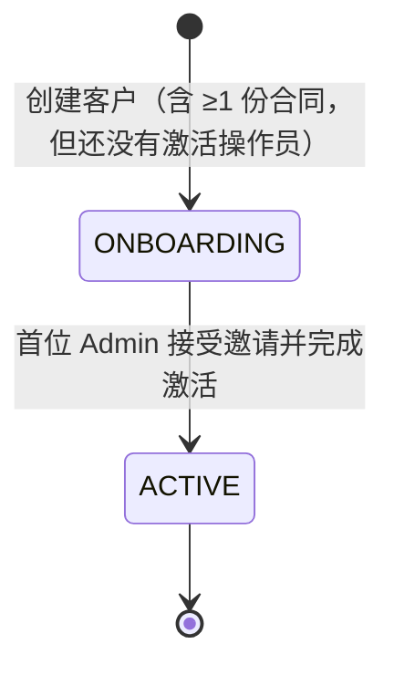
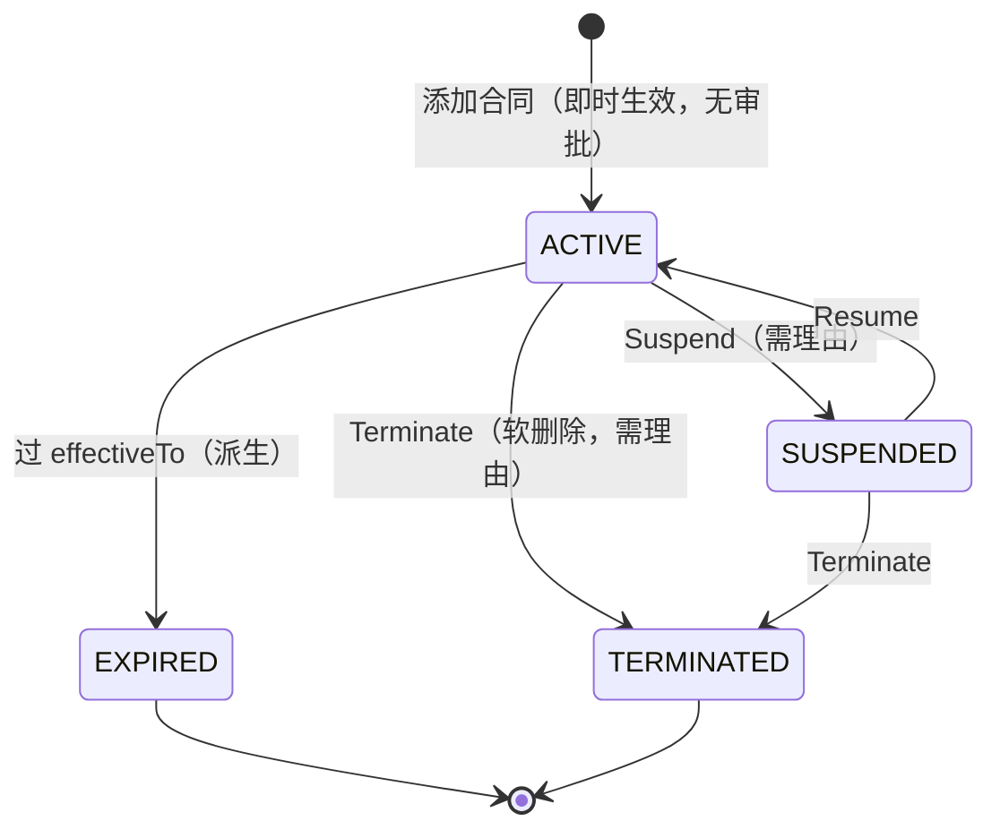

# Customers 客户 — 业务流程与规则

客户是平台（NPT）授权接入的合作商公司：以 ISO / ISV 身份接入、或作为 Merchant 商户。本模块管客户公司档案、其名下的**合同**（授权它做什么、按什么价），以及登录客户租户的**操作员**。跨模块：合同决定设备 / 应用的权益与计费；ISO 客户名下有下游子商户（只读 Merchants 视图）；客户在目录下样机订单（见 orders 模块）。

> 状态：核心行为均已确认。客户实体只有 Onboarding / Active 两态（无客户级 LOCKED）；合同按家族逐份管理、添加即时生效；操作员接入靠单一 Admin 激活邀请，普通操作员由客户自己的 Admin 在租户门户管理。已确认废弃、不写入规范的旧功能：客户级 LOCKED、PENDING 合同态、多操作员带角色邀请、Delegate operations。

## 1. 后台处理与跨模块业务规则（重点）

### **RULE-CUS-07** 〔确认〕

敏感字段默认脱敏，单字段 Reveal 记审计。
  - 客户 / 操作员的 Email、Phone、操作员姓名等默认按位脱敏显示；逐字段点 Reveal 才明文，且每次 Reveal **记入审计**并 toast 提示。

### **RULE-CUS-08** 〔确认〕

按合同类型联动出附加只读视图：ISO 看下游商户、Merchant 看门店与终端。
  - 这些附加页在 ADMIN 后台**只要客户名下曾签过该类型合同就显示，不看合同当前是否生效**（含已暂停 / 已过期 / 已终止）。
  - 客户**名下有 ISO 合同（不论状态）**：详情多出 **Merchants** 页——**只读**浏览该 ISO 名下的下游子商户（门店 / 终端 / 应用 / 合同），平台 admin 不能在此编辑（这些由 ISO 操作员在其门户维护）。
  - 客户**名下有 MERCHANT 合同（不论状态）**：详情多出 **Stores**（按门店看 TID / VarSheet 绑定）与 **Devices**（按终端看应用与事件）页。
  - 这些视图的数据来自商户 / 设备 / 应用模块（跨模块**只读**桥接），随上游变化，不在本后台落库或编辑。

### **RULE-CUS-09** 〔确认〕

首位 Admin 激活触发的跨模块状态推进与分工。
  - **第一封被接受**的 Admin 邀请 → 客户实体 `Onboarding → Active`（派生态，见 RULE-CUS-01）。
  - 激活动作本身（账号合并 / 注册、设密码 + 2FA）由**门户侧全屏 onboarding 流程**接管，本后台只落最终状态、不亲自执行。
  - 激活后普通操作员的新增与角色分配**转由客户自己的 Admin 在租户门户维护**，本后台不再逐人管理（仅保留重置密码、锁定 / 解锁的有限运维，见 RULE-CUS-06）。

### **RULE-CUS-10** 〔确认〕

合同 Suspend 的后台关联处理（门户 / 网关侧实现，本后台只产状态变更）。
  - 该合同下操作员被**网关拒绝登录**。
  - 该合同名下**未消费的邀请链接失效**。
  - **在途订单继续推进、不冻结**。
  - Suspend 的界面动作与可逆性（需理由、可 Resume）见 RULE-CUS-03。

### **RULE-CUS-11** 〔确认〕

合同权益的下游消费。
  - 每份合同的权益配置被**设备 / 应用模块**消费，决定设备可用的增值服务与**按设备计费**。
  - 本模块只**定义**权益（见 RULE-CUS-05），实际启用与计费在下游执行。

**跨模块边界指针：**
- 客户在商品目录下样机订单 → 见 **orders 模块**。

## 2. 业务规则（本模块自身 / 界面骨架）

### **RULE-CUS-01** 〔确认〕

客户实体生命周期：建档即 Onboarding，首位 Admin 激活后转 Active。
  - 新建客户时实体状态为 **Onboarding**：公司已登记、合同已配，但还没有任何已激活的操作员。
  - 当首位 Admin 接受邀请、完成账号激活后，实体自动转 **Active**（激活触发的跨模块关联见 RULE-CUS-09）。
  - 实体状态是**数据模型里定义的状态字段**（不是临时算出来的），取值只有 Onboarding / Active 两种；客户列表 / 详情顶部据此显示，无手动开关。

### **RULE-CUS-02** 〔确认〕

新建客户向导：Company → Contracts → Done，至少一份合同。
  - **Step 1 Company**：公司名、Country、Timezone 必填；License、地址、联系人、Email、Phone 可选，但 Email / Phone 填了就要格式合法（Phone 填了须带区号）。
  - **Step 2 Contracts**：逐份添加合同，**至少一份**才能继续；向导里**只暴露 ISO / ISV（含各自 Pilot）**，MERCHANT 合同要在客户详情 Contracts 页后续追加。每份合同创建即生效。
  - **Step 3 Done**：提示客户已创建、等待首位 Admin，引导去邀请 Admin。
  - 创建后实体落 **Onboarding**（见 RULE-CUS-01）。

### **RULE-CUS-03** 〔确认〕

合同模型与生命周期：按家族管理，添加即时生效、终止 / 暂停可逆性分明。
  - 合同分**家族**：ISO、ISV（各有正式版与 Pilot 版）、MERCHANT、ADMIN。**同一家族同一客户只能有一份生效中的合同**（正式版存在就不能再开 Pilot；Pilot 在跑时要先终止才能换正式版——即转正，见 RULE-CUS-04）。
  - **添加合同**：在详情 Contracts 页「Add contract」，**无审批、无重新签署，点击即生效**，记审计。
  - **Suspend / Resume**：暂停后客户访问被挡、但合同仍在档，可恢复；Suspend 需填理由。（暂停关联的网关 / 邀请 / 订单后台处理见 RULE-CUS-10。）
  - **Terminate（终止）**：标记为已终止、需填理由，保留历史不真正删；列表 / 标题栏默认只显示生效中的合同。
  - **已过期（EXPIRED）**：合同过了生效截止日期就自动算作已过期（系统实时算出来的，不是手动改、也不单独存）。
  - 每份合同携带与类型相对应的**权益**配置（见 RULE-CUS-05）。

### **RULE-CUS-04** 〔确认〕

Pilot 是合同**类型**（试用），不是独立状态。
  - Pilot 合同是 **180 天试用、全部费用锁定为 $0**，生效起 +180 天自动定到期日。
  - Pilot 是类型属性、与正式版无父子状态联动；系统里它仍按生效状态记，"Pilot" 由类型派生显示。
  - 到期前可在合同行**延期**（+30/60/90 天）。
  - **转正（Convert）**：把在跑的 Pilot 换成正式合同——一步内**终止 Pilot**（记一条转正记录）并**新建一份生效的正式合同**、带新配置的权益与条款；转正后该家族不能再退回 Pilot。
  - Pilot 的权益形态与正式版不同（试用期增值功能为开关、无价；正式版按价计费）——具体字段见 models。

### **RULE-CUS-05** 〔确认〕

合同权益按类型不同：决定客户能用哪些设备 / 增值服务及计费。
  - **ISO**：结算币种 + 设备基础服务月费 + 增值功能（FlyDesk / GeoLocation / GeoFencing〔依赖 GeoLocation〕/ Pre-warning），按设备每月计费。
  - **MERCHANT**：结算币种 + 支付服务（按设备月费）+ 电子小票服务（月费 + 投递渠道）。
  - **ISV / ADMIN**：当前模型无权益项。
  - Pilot 版增值功能为免费开关（见 RULE-CUS-04）。权益的具体字段 / 枚举 / 校验归 `models/`。
  - 这些权益如何被下游设备 / 应用消费、计费，见 RULE-CUS-11。

### **RULE-CUS-06** 〔确认〕

操作员接入靠**单一 Admin 激活邀请**。
  - 客户详情 Operators 页生成**一条 Admin 激活链接**（角色固定 Admin、有效期 7 天）：可 Copy link、Send via email、Regenerate（重生成使旧链接失效）、Revoke。
  - 受邀人打开链接 → 全屏接管的 onboarding 流程：用现有账号加入或注册新账号 → 设密码 + 2FA → 激活。
  - 本后台对操作员行只做有限运维：**重置密码、锁定 / 解锁账号**；不在本后台逐人分配角色（角色分配在租户侧）。
  - 客户详情把**操作员**与**角色**拆成两个独立页签：**Operators** 页管激活链接与操作员运维（上述）；**Roles** 页只看 / 配本客户可用的角色——展示合同范围内适用的系统角色（只读，目录在单独的「Customer Role Definitions」页维护），并可新增 / 删除**仅本客户可见**的自定义角色；逐人的角色分配仍在租户侧，不在此页做。
  - 激活后该人成为客户首位操作员（Admin），并触发实体转 Active、门户 / 租户侧分工——见 RULE-CUS-09。
  - 敏感字段按 RULE-CUS-07 脱敏。

## 3. 状态机

**客户实体状态（数据模型定义的字段，非手填）**：取 Onboarding / Active 两态，随生命周期推进（建档为 Onboarding，首位 Admin 激活后转 Active）。新建即 `ONBOARDING`；首位 Admin 接受邀请后转 `ACTIVE`（见 RULE-CUS-01、RULE-CUS-09）。访问控制下沉到合同逐份 Suspend，**没有客户级 LOCKED 状态**。

**合同状态（每份合同各自一套）**：客户名下每份合同独立走此机。已过期（EXPIRED）是按生效截止日期实时算出来的态、不单独存。Pilot 是合同**类型**属性、不是状态（见 RULE-CUS-04）。

## 4. 主流程

_(暂无)_

## 5. 开放问题登记

_(暂无)_
