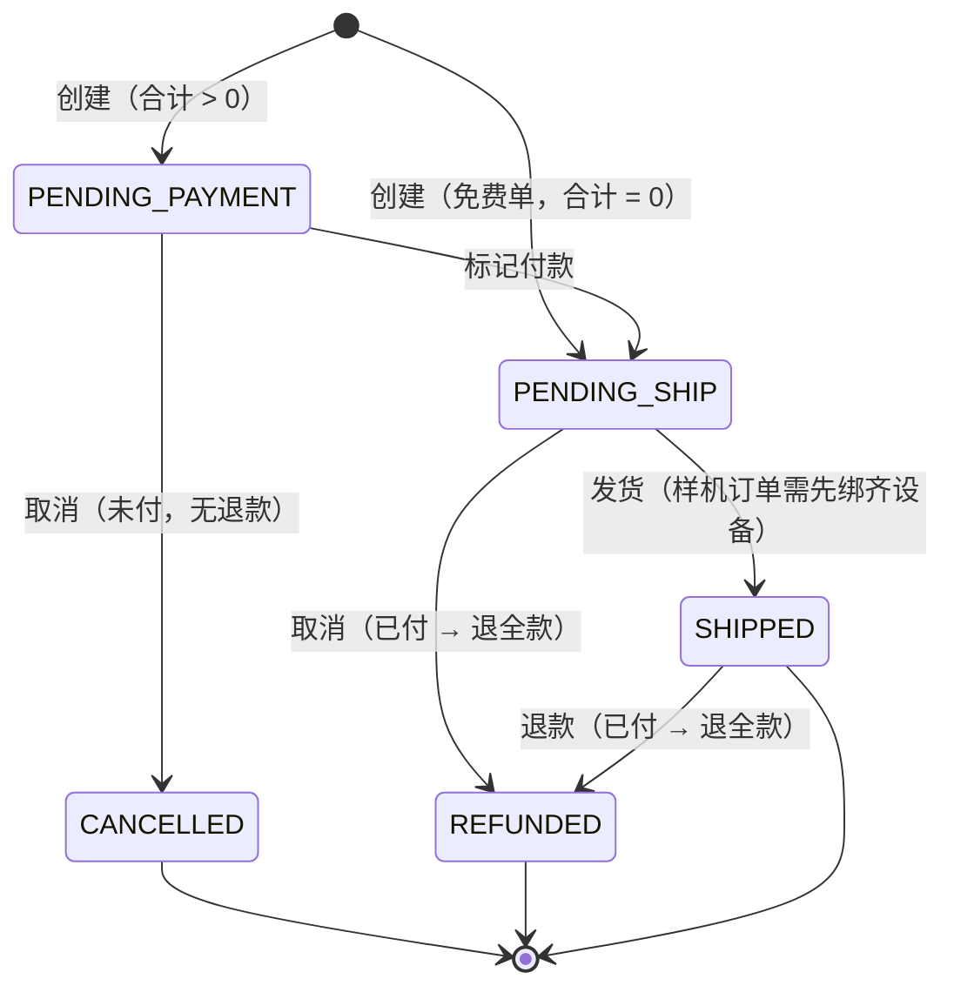

# Orders 订单 — 业务流程与规则

订单是 Sales 域里贯穿"下单到发货"的主线：运营在 Catalog 替客户下单后生成订单，订单再走收款、发货、（必要时）取消或退款。订单只认下单那一刻快照下来的订单行，不回查商品目录。订单本身管金额与状态流转；发货时把实体设备绑定到订单要写设备表，属跨模块动作。

> 状态：核心行为已与业务确认。要点：无"已送达"状态、最终态即已发货；系统不接真实支付，收款/退款只是人工标记；免费单跳过收款直接待发货；仅样机订单用 6 位授权码绑定设备、记录写设备表，发货前绑齐、发货后锁定；取消按已付未付分流（未付→已取消、已付→全额退款）；订单创建后整单不可改。无遗留开放问题。

## 1. 后台处理与跨模块业务规则（重点）

### **RULE-ORD-01** 〔确认·推论〕

订单从 Catalog 结算生成，订单行是**下单那一刻的快照**，之后目录怎么改都不动这张订单。
  - 结算提交时，把购物车订单行 + 客户 + 收货 + 折扣 + 订单类型组装成订单（见 RULE-CAT-04）。每个订单行存的是当时 SKU 的名称、属性、图片、成交价，订单读自己的快照、不回查目录（呼应 RULE-PRD-03 / RULE-CAT-03）。
  - 订单号形如 SO-年份-四位流水，记录创建人与创建时间。

### **RULE-ORD-02** 〔确认·推论〕

下单金额决定起始状态：**合计为 0 的免费单跳过收款、直接"待发货"**；合计大于 0 起始"待付款"。
  - 折扣按比例或按固定金额、二选一互斥；满折（100% 或折到 0）即免费单、合计为 0。
  - 这条与 Catalog 侧一致（见 RULE-CAT-05），订单接收时按此落起始状态。

### **RULE-ORD-03** 〔确认〕

标记收款：把"待付款"推进到"待发货"，并记下收款方式、流水号、经办人与时间。
  - 收款方式可选：公司电汇、现金、支票、信用卡/借记卡、ACH/直接扣款、内部冲抵/额度、其他（其他需补充说明）。
  - 收款是人工标记（运营确认收到钱后点"标记付款"），不是系统自动对账；记下方式 + 参考/收据号 + 经办人 + 时间。
  - **一次性全额标记**，没有分期 / 多次收款；付了就进"待发货"。

### **RULE-ORD-04** 〔确认〕

发货：把"待发货"推进到"已发货"，可填物流单号。**样机订单发货前必须先把所有设备绑定齐**。
  - 含设备项的**样机订单**：发货前要逐台用授权码把设备绑到订单（见 RULE-ORD-05），全部绑齐才能发货；没绑齐点发货会被拦下、跳到授权页提示还差几台。
  - 物流单号可选填。

### **RULE-ORD-05** 〔确认〕

发货绑定设备：仅样机订单、含设备项时，用 **6 位授权码**逐台把设备绑到订单，**记录写入设备表**（跨模块）。
  - 仅**样机订单**且含设备类商品时才有"授权"这一步；服务、配件没有序列号，跳过；**生产机订单即便含设备也直接发货、没有授权步骤、不绑定**。
  - 绑定在**发货前**（待发货阶段）进行：运营输入或扫描每台设备开机屏上的 6 位授权码，系统据码定位到具体设备、把它绑到订单的对应订单行，**绑定记录落到设备表**。
  - 校验：码必须 6 位；查无设备的码拒绝；同一订单内重复的码拒绝；绑定数不超过该订单行数量。
  - 发货前可逐台解绑：解绑后该设备记录从设备表释放，这台又可被重新绑定。**一旦发货，设备绑定锁定**——不能再单独改 / 解绑设备，要动只能整单取消（见 RULE-ORD-06）。

### **RULE-ORD-06** 〔确认〕

取消按"付没付钱"自动分流：**未付款 → 直接取消（不退钱）；已付款 → 取消并退全款**。
  - 待付款（未付）取消 → 关单为"已取消"，无退款。
  - 已付款（待发货 / 已发货）取消 → 关单为"已退款"，把订单合计退还给客户。
  - 退款**只能全额**（退订单合计），不支持部分退款。
  - 取消要填理由；关掉的订单不能再开（终态）。

### **RULE-ORD-10** 〔确认〕

系统**不接真实支付**：收款、退款都只是人工状态标记，不发生真实资金流转。
  - "标记付款"和"取消退款"只把订单状态改成已付 / 已退款并记下方式与经办人，系统不对接支付网关、不真正扣款或打款。
  - 真实的收付款在系统外完成（电汇、支票等），运营确认后回系统打标记。

**跨模块边界指针：**
- 订单从哪来（Catalog 替客户下单、选客户、改价、折扣、订单类型）→ 见 **catalog 模块**。
- 设备本身、授权码、设备表的归属与状态 → 见 **devices 模块**。
- 订单行里商品 / SKU 的定义与快照口径 → 见 **products 模块**（RULE-PRD-03）。
- 所有变更记审计 → 继承 RULE-PRD-13 的全系统审计基线（收款、发货、取消/退款、绑定/解绑都应记录）。

## 2. 业务规则（本模块自身 / 界面骨架）

### **RULE-ORD-07** 〔确认〕

订单列表：按客户（含订单号）、类型、金额、状态、创建时间展示，可排序筛选。

### **RULE-ORD-08** 〔确认〕

订单详情 Overview：状态流水线 + 订单行 + 金额（原价/折扣/合计）+ 客户与收货 + 元信息 + 操作。
  - 状态流水线展示待付款 → 待发货 → 已发货三步；免费单的第一步显示"无需付款"。终态（已取消/已退款）以横幅展示、不进流水线。
  - 操作按当前状态出现：待付款出"标记付款"，待发货出"发货"，可取消时出"取消订单"。
  - 金额区显示原价合计、折扣、合计；合计为 0 显示 FREE。

### **RULE-ORD-09** 〔确认〕

订单类型样机 / 量产在下单时定（见 RULE-CAT-06），订单详情只读展示，不在订单里改。

### **RULE-ORD-11** 〔确认〕

订单**创建后整单不可编辑**：订单行 / 数量 / 价 / 客户 / 收货都不能改，下错只能取消重下。
  - 发货后更是只能整单取消（→ 退款），连已绑定的设备也不能再单独改（见 RULE-ORD-05）。

## 3. 状态机

**订单状态**：主线 待付款 → 待发货 → 已发货。免费单从待发货起步（跳过待付款）。取消 / 退款是终态、不可再开。

## 4. 主流程

_(暂无)_

## 5. 开放问题登记

_(暂无)_
