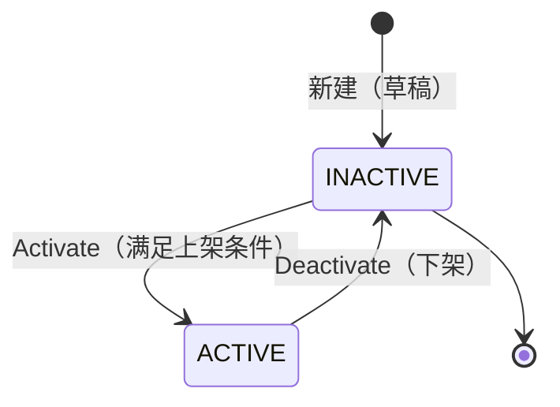
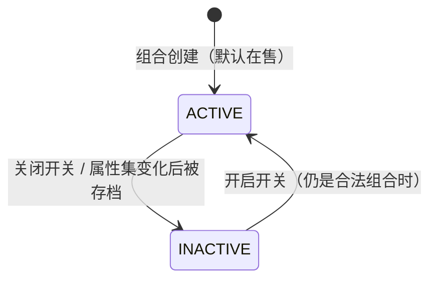

# Products 商品 — 业务流程与规则

商品只有ADMIN平台可管理，不对客户开放下单：商品挂在分类下，分类决定它能用哪些属性，属性的取值组合出一个个 SKU（带价、可单独上下架）。客户在目录里挑商品下样机 / 量产订单（见 orders 模块）。商品本身不碰钱、不发货——它只定义"卖什么、什么价"，钱与履约都在订单侧发生。商品类型当前仅 SINGLE（单品）；**套装（bundle）本期不开发**。

> 状态：核心行为已与业务确认。要点：**整个 Sales 域（商品/分类/订单等）只在平台 ADMIN 后台操作、不对客户开放**；下单可对订单行手填成交价（覆盖目录价）；改已被订单买过的 SKU 价格可直接生效、无额外拦截；已下过单的 SKU 锁定属性组合、不可删除（无订单关联的孤儿 SKU 在组合失效时清除）；改分类属性会自动同步到在售商品用到它的 SKU、应用前先提示影响范围；所有变更记审计；不允许同名商品；上架无审批。无遗留开放问题。

## 1. 后台处理与跨模块业务规则（重点）

### **RULE-PRD-01** 〔确认〕

改分类属性会**自动同步到该分类下在售商品的 SKU**——但只在这个属性真被某商品用于 SKU 组合时才影响它；自动应用前先提醒运营哪些属性变更会动到哪些 SKU。
  - 分类属性有两个来源：自管分类自己维护；绑定了设备型号的分类，属性只读取自该型号（要改就去改型号）。不论哪种来源，下面的同步规则都一样。
  - 改动分类属性（增 / 减属性或取值）时，系统会**自动更新该分类下在售商品的 SKU**；但只有当某商品确实把这个属性用在了它的 SKU 组合里，才会动到它——没用到的商品不受影响。
  - 自动应用**之前**，系统先提醒运营：这次属性变更会影响哪些商品的哪些 SKU，确认后才生效（避免在不知情下改动在售商品）。
  - 受影响商品的 SKU 怎么重算（保留 / 转存档 / 清除），按 RULE-PRD-02、RULE-PRD-05 处理。

### **RULE-PRD-02** 〔确认〕

已下过单的 SKU 不能再改它的属性组合、也不能被删除；改价可以直接改、没有额外拦截。
  - "已下过单的 SKU"指被任何订单用过的 SKU。它"是哪个属性组合"被锁定、不能再改成别的组合，也不会被删除（否则历史订单指向的东西会对不上）。
  - 这种 SKU 的**价格仍可直接改**，没有二次确认、没有特别提示，且只影响以后的新订单（已下的订单在下单那刻就把成交价存进订单了，见 RULE-PRD-03）；上下架也能随时切。
  - 在商品编辑页增减属性或取值时，系统会重新核对现有 SKU：还成立的组合原样保留（价、上下架状态不变）；已经不成立的旧组合按"有没有订单关联"分开处理——**有订单关联的**转成只读存档、留给历史订单（已停售存档 SKU，见 RULE-PRD-05）；**无订单关联的（即孤儿 SKU）**直接清除、不留痕。
  - 给商品新增一个属性时，新拆出来的组合会**沿用**老组合在原有属性上同值的那个价格（这样加属性不会把已设好的价弄丢）；找不到可沿用的就用默认价。

### **RULE-PRD-03** 〔确认〕

下单时把商品信息**快照**进订单订单行，且成交价可在下单时**覆盖目录价**；目录后续怎么改都不动历史订单。
  - 加入订单的瞬间，订单订单行快照下该 SKU 的**名称、属性、图片、成交价**。
  - 成交价默认取 SKU 目录价，但**下单时可对订单行手填价覆盖**（目录价只是默认值）。
  - 之后改商品名 / 改价 / 下架 → **历史订单一律不受影响**，订单读自己的快照、不回查目录。

### **RULE-PRD-04** 〔确认〕

只有"在售商品 + 在售且仍在卖的 SKU"可被下单；下架即从可下单列表移除，不动历史。
  - 下单选品只列 status=ACTIVE 且至少有一个在售 SKU 的商品；多 SKU 弹选择器、单 SKU 直接加。已停售存档的 SKU 永不出现在可选项里。
  - 商品 Deactivate（转 INACTIVE）→ 立即从可下单列表移除；历史订单不受影响。商品的 ACTIVE / INACTIVE 即"上架 / 下架"，决定它在下单选品时能不能被选。

### **RULE-PRD-05** 〔确认〕

组合失效的 SKU 按"有没有订单关联"分两种处理：孤儿 SKU 清除，已下过单的转为只读存档。
  - **孤儿 SKU 指无订单关联的 SKU**（从没被任何订单用过）。它平时在商品里正常存在、可正常售卖；只是因为没有历史订单依赖它，一旦它的属性组合因改属性而不再成立，就会被直接清除、不留痕。
  - **有订单关联、但组合已失效的 SKU** 则不能删——要留给历史订单对账，于是转为"已停售存档"：在商品编辑页以只读分区呈现（"不再售 · 为历史订单保留"），不可改、不进售卖。
  - 这些都是系统实时算出来的（看"组合还成不成立 + 有没有订单关联"）；SKU 自身只存"在售 / 停售"两个状态，不另存这些标记。

### **RULE-PRD-13** 〔确认〕

**所有变更都要记审计（全系统基线）。**
  - 商品 / 分类 / SKU 的新建、编辑、上下架、改价、改属性、删分类等一切变更，都记入审计日志。
  - 这是全系统统一要求，不止商品模块；orders 等同样适用。

### **RULE-PRD-12** 〔确认〕

**整个 Sales 域（商品 / 分类 / 订单等）只在平台 ADMIN 后台操作，不对客户开放**——商品 / 分类是其中一环。
  - 新建、编辑、上下架商品，以及管理分类与分类属性，都只在平台 ADMIN 后台进行。
  - 客户租户侧没有任何 Sales 功能入口（不能管商品 / 分类、不能看订单后台）；客户只在下单时看到可售商品。
  - 这是 Sales 域的统一权限基线，orders 等同域模块同样适用。

**跨模块边界指针：**
- 客户在目录下样机 / 量产订单、订单的收款与发货、下单时的成交价手填 → 见 **orders 模块**。
- 分类属性的来源型号、型号属性本身 → 见 **devices 模块**（DEVICE MODEL）。

## 2. 业务规则（本模块自身 / 界面骨架）

### **RULE-PRD-06** 〔确认〕

商品生命周期：新建即草稿（INACTIVE），Activate 后上架（ACTIVE），可随时 Deactivate 下架；**无审批**。
  - 新建走 3 步向导（Details → Attributes & pricing → Review & activate），满足条件即可 Activate，无审批环节。
  - 上架要求：选了分类、填了名、至少一张图、至少一个在售 SKU 且价合法。
  - 已上架商品在详情页可 Save changes 或 Deactivate；已下架可重新 Activate。下架的后台波及见 RULE-PRD-04。

### **RULE-PRD-07** 〔确认〕

商品挂在**叶子分类**下；属性只能从分类属性里**选子集**，不能新增。
  - 分类是树，商品只挂叶子节点，父级仅用于归类。
  - 商品能选用分类属性的一个子集，每个属性也能只提供部分取值，但**绝不能用分类没有的属性 / 取值**。
  - 换分类会清空已选属性（必须来自新分类）。

### **RULE-PRD-08** 〔确认〕

SKU 由所选各属性取值**交叉组合**而来，一个组合一个 SKU；不选属性就是单个 SKU。
  - 每个 SKU 带价、可单独上下架；展示名由"商品名 + 各属性取值"组合而出，**不展示编码 / UUID**。
  - 商品列表 / 详情的价格按在售 SKU 显示区间。

### **RULE-PRD-09** 〔确认〕

商品**无库存概念**，所有在售 SKU 视为无限可售。

### **RULE-PRD-10** 〔确认〕

样机 / 量产的区分**不在商品上**，而是下单时选的订单类型。
  - 商品不分样机 / 量产；同一商品既可被下成样机订单、也可下成量产订单，由订单的 order_type 决定（见 orders 模块）。

### **RULE-PRD-11** 〔确认〕

分类删除有限制：**名下有商品、或还有子分类时不可删**。
  - 删除前检查：该分类（含子孙）下商品数为 0 且本身是叶子（没有子分类）才允许删；否则弹窗说明不可删原因。

### **RULE-PRD-14** 〔确认〕

**不允许同名商品**：新建 / 改名时商品名不能与已有商品重名。

## 3. 状态机

**商品状态**：新建为 INACTIVE（草稿 / 下架），Activate→ACTIVE（上架），Deactivate→INACTIVE。无审批、无中间态。

**SKU 状态**：只存 ACTIVE / INACTIVE 两态（手动上下架开关）。已下过单的 SKU 不可删；无订单关联的孤儿 SKU 在组合失效时被清除。"已停售存档"是系统算出来的、不单独存（见 RULE-PRD-05）。

## 4. 主流程

_(暂无)_

## 5. 开放问题登记

_(暂无)_
